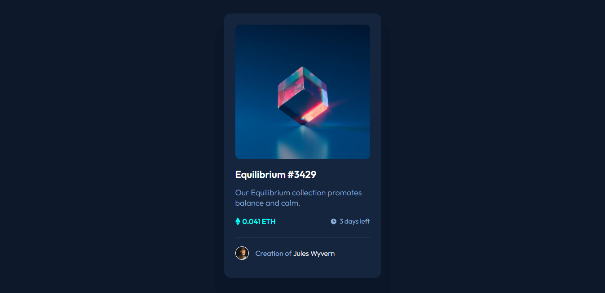

# Frontend Mentor - NFT preview card component solution

This is a solution to the [NFT preview card component challenge on Frontend Mentor](https://www.frontendmentor.io/challenges/nft-preview-card-component-SbdUL_w0U). Frontend Mentor challenges help you improve your coding skills by building realistic projects.

## Table of contents

- [Overview](#overview)
  - [The challenge](#the-challenge)
  - [Screenshot](#screenshot)
  - [Links](#links)
- [My process](#my-process)
  - [Built with](#built-with)
  - [What I learned](#what-i-learned)
- [Author](#author)
- [Acknowledgments](#acknowledgments)

## Overview

### The challenge

Users should be able to:

- View the optimal layout depending on their device's screen size
- See hover states for interactive elements

### Screenshot



### Links

- Solution URL: [https://www.frontendmentor.io/solutions/results-summary-component-I4PiUqkaCH](https://www.frontendmentor.io/solutions/results-summary-component-I4PiUqkaCH)
- Live Site URL: [https://lucassilvaaraujo.github.io/results-summary-component-main/](https://lucassilvaaraujo.github.io/results-summary-component-main/)

## My process

### Built with

- Semantic HTML5 markup
- CSS custom properties
- Flexbox
- CSS Grid

### What I learned

In this project I learned how to use the "transition" in css, yes, I'm a newbie XD. But I'm proud of it, everyone should start it from somewhere right? Also I learned to declarate variables in css to colors, a better way to use colors when I repeat too much of them... Look beyond some parts that I used.

```css
:root {
    --color-cyan: hsl(178, 100%, 50%);
    --color-white: hsl(0, 0%, 100%);
    --soft-blue: hsl(215, 51%, 70%);
}

.nft-preview-card-component-main .nft-preview-card .description .title {
    color: var(--color-white);
    font-size: 22px;
}

.nft-preview-card-component-main .nft-preview-card .description .paragraph {
    color: var(--soft-blue);
    font-weight: 300;
}

.nft-preview-card-component-main .nft-preview-card .description .title:hover {
    transition: 0.4s;
    color: var(--color-cyan);
}

.nft-preview-card-component-main .nft-preview-card .creator .creator-name span:hover{
    transition: 0.4s;
    color: var(--color-cyan);
}

.nft-preview-card-component-main .nft-preview-card .nft-image .icon:hover {
    transition: 0.3s;
    opacity: 1;
}
```

## Author

- Website - [Lucas Araújo](https://lucassilvaaraujo.github.io/portfolio/)
- Frontend Mentor - [@LucasSilvaAraujo](https://www.frontendmentor.io/profile/LucasSilvaAraujo)
- Twitter - [@shalkzera](https://instagram.com/shalkzera)

## Acknowledgments

I wanna give some thanks to [@LaissonBruno](https://github.com/laissonbruno) that help me alot in this project (like always xD).